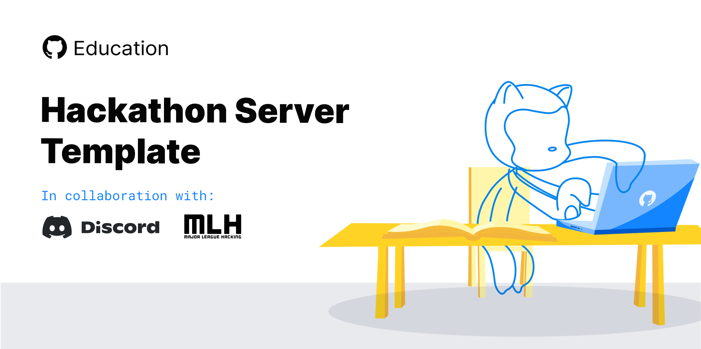

  

<h3 align="center">Discord Hackathon Template</h3>

---

 Get started with using Discord for your virtual Hackathon.
      

## 🧐 About 

Ever wanted to supercharge your online hackathon with Discord, but didn't know where to start? Fear not! This template, and the documentation below, gets you set up and running with your very own Hackathon Discord server in minutes. With a one-click server template packed full of pre-configured channels and roles, and all the documentation and resources to get your event going, this is your one-stop-shop for running a successful hackathon - or any other virtual event - on Discord.

## 🏁 Getting Started 

To get started with all these fantastic resources, you'll need the GitHub Student Developer Pack, a Discord account, and a little background knowledge of Discord! If you already have all of these, you can speed through to using the Hackathon Template below, and begin fleshing out your server with Bots, graphics, and event ideas.

### Prerequisites

1. Get the [GitHub Student Developer Pack](https://education.github.com/pack)
2. Create a [Discord account](https://support.discord.com/hc/en-us/articles/360033931551-Getting-Started)
3. Check out the [Beginner's Guide to Discord](https://support.discord.com/hc/en-us/articles/360045138571-Beginner-s-Guide-to-Discord)

### Setting up your server

Now that you're all set up with a Student Dev Pack, have a Discord account, and know the basics of using Discord, you're ready to create your very own Hackathon server! We've provided a Discord Server template, at the link below, for you to get started with. This comes pre-loaded with all the channels, roles, and permissions you need for a Hackathon server. 

:warning: **You can only use this template to set up a brand new server**, so if you've already got a server going, you can either delete it and start a new one, or open up the template on a spare server and use it for inspiration and improvement!

*Template goes here*

[Hackathon Server Template](discord.new)

### Template Structure

#### Roles
1. Event Staff
2. Mentor
3. Speaker
4. Judge
5. Attendee

#### Categories and channel

- Welcome
  - A: 📢| announcements
  - T: #👋| welcome
  - T: #📝| rules
  - T: #❓| faq-and-resources
  - T: #🌱| getting-started

- Mod
  - T: #💬| staff-chat
  - T: #🎖| judging
  - T: #🛡| mod-log
  - V:📣 Staff War Room

- General
  - T: #🔰| introductions
  - T: #💬| general
  - T: #❓| event-questions
  - V:🏛 Main Stage
  - V:☕️ Lounge
  - V:🎙 Breakout Room

- Sponsor-1
  - T: #💬| sponsor-1

- Activities
  - T: #👾| off-topic
  - T: #🎒| workshop
  - V:🎙 workshop

- Mentoring
  - T: #👤| whois
  - T: #✋| get-a-mentor
  - T: #💬| mentor-room-1
  - V:🎙 Mentor Room 1

### 🤖 Bots
| Bot | Description |
|-|-|
| [Zira.gg](https://zira.gg) | Zira lets users add and remove roles for themselves by simply reacting to a message. |
| [Ticket Tool](https://tickettool.xyz/) | Ticket Tool is a highly versatile support bot for Discord. It allows private support channels, or Tickets, between your staff team and individual users to be created. |
| [Templae](https://github.com) | Template |

## 🎈 Usage 

Add notes about how to use the server.

### Announcements
How should Hackathon organizers use the announcements channel.

### Mini Events
How should Hackathon organizers organize mini events on Discord.

### Tips & Trics
## ✍ Contributors  

<!-- readme: collaborators,contributors -start -->
<table>
<tr>
    <td align="center">
        <a href="https://github.com/hoges">
            
             
            <b>Hoges</b>
        </a>
    </td>
    <td align="center">
        <a href="https://github.com/wrussell1999">
            
             
            <b>Will Russell</b>
        </a>
    </td>
    <td align="center">
        <a href="https://github.com/juanpflores">
            
             
            <b>Juan Pablo Flores </b>
        </a>
    </td></tr>
</table>
<!-- readme: collaborators,contributors -end -->

### Partners

<!-- readme: hoges,mpsiebert -start -->
<table>
<tr>
    <td align="center">
        <a href="https://github.com/hoges">
            
             
            <b>Hoges</b>
        </a>
    </td>
    <td align="center">
        <a href="https://github.com/mpsiebert">
            
             
            <b>Mpsiebert</b>
        </a>
    </td></tr>
</table>
<!-- readme: hoges,mpsiebert -end -->

## 🎉 Acknowledgements 

- Hat tip to anyone whose code was used
- Inspiration
- References
